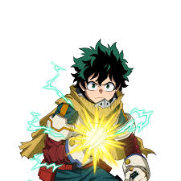
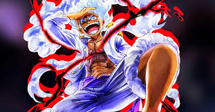
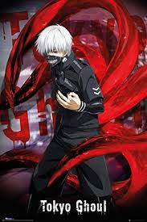

</head>

<body>

<audio controls autoplay loop>
    <source src="Dolce camara.mp3" type="audio/mpeg">
</audio>

<h1>Je vais vous montrer mes personnages de manga préférés</h1>

Voici mon personnage de manga

C'est Izuku Midoriya de My Hero Academia (MHA).

Là c'est mon deuxième personnage préféré

C'est Monkey D. Luffy de One Piece

Voici un autre de mes personnages préférés

C'est Keneki de Tokyo Ghoul

</body>
</html>
